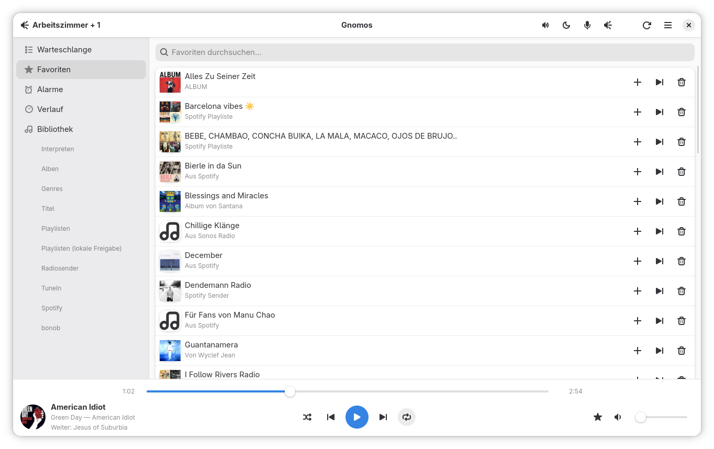
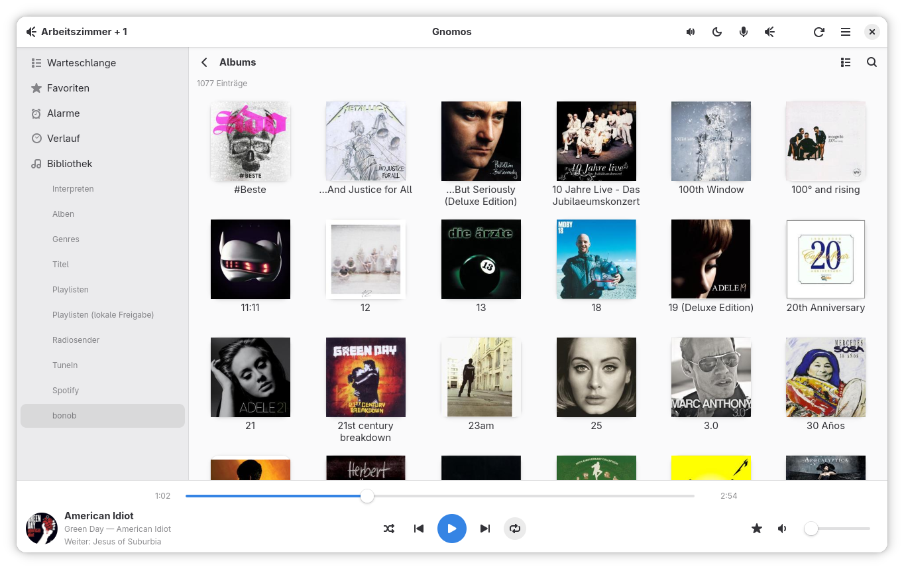

# Gnomos

Gnomos is a GTK4/libadwaita application for controlling Sonos speakers from
the GNOME desktop. It talks directly to your Sonos system over the local
network — discovery, playback, volume, grouping, queue, favorites, alarms —
and pays particular attention to first-generation hardware (ZP80, ZP90,
ZP100, ZP120, CR100) that Sonos's own current apps have dropped support for.

## Screenshots

<p align="center">
  
  
</p>

Left: the Favorites tab, with the section sidebar (queue, favorites,
alarms, history, library) and the library's own root categories listed as
sub-items underneath "Bibliothek", plus the bottom Now Playing bar. Right:
the cover-art grid view for a linked third-party service's Albums listing
(here, bonob) — the same list/grid toggle is available for the local
library's own Albums and Artists.

## About

Gnomos is built on top of [libnoson](https://github.com/janbar/noson), the
C++ library originally written for [noson-app](https://github.com/janbar/noson-app),
a Qt/QML Sonos controller for Linux, BSD and other Unix-like systems. If
you're looking for a mature, actively maintained Sonos client and don't mind
a Qt-based UI, noson-app is very much worth using — it already does
everything Gnomos does and more.

Gnomos exists because I wanted a native GNOME application instead: something
built with GTK4 and libadwaita that looks and behaves like the rest of my
desktop, rather than a Qt/QML app running alongside it. Since noson-app's
own libnoson backend already does the hard work of actually talking to
Sonos hardware, writing a new frontend on top of it seemed like a
reasonable way to give noson new legs as a proper GNOME citizen, without
starting from zero on the UPnP/SOAP side. Gnomos does not modify or fork
libnoson; it links against it as a git submodule and uses its public API.

The first-generation focus comes from the same motivation: those speakers
are still fully functional, just no longer supported by Sonos's current
apps, and I wanted a modern client I could keep running on my own hardware.

## Features

- Discovery of Sonos zones on the local network, with a header-bar
  spinner showing whenever the app is actually waiting on a response
  from the Sonos system
- Playback controls, volume and mute — aware of multi-room groups, not just
  a single speaker
- Shuffle and repeat, including repeat-one, with both greyed out on
  sources that don't support them (radio, line-in)
- Zone grouping and ungrouping (including a one-click "disband group"),
  with a per-room volume slider
- A bottom Now Playing bar with cover art, a wide seek bar, and track
  details (with quick links to search the library for the current artist
  or album)
- Queue management: reordering, removing tracks, saving as a Sonos playlist
- Favorites, with search, "add to favorites" from anywhere in the library,
  and "play all"/"add all to queue" for the whole list
- Alarms: create, edit, duplicate, enable/disable, delete, with a sound
  preview and a "next alarm" indicator
- A play history tab (tracked locally, since Sonos doesn't keep one), with
  a quick "search the library" action per entry
- Local music library browsing, with a toggle between list and cover art
  grid for Albums/Artists and similar (local and third-party services
  alike), consistent GNOME iconography per category (artist/album/genre/
  playlist) — while a linked service's own root-menu categories (Albums,
  Random, Favourites, Top Rated, ...) keep that service's own icon
  instead — a live filter for narrowing down a long list as you type,
  "play all"/"add all to queue" for a track listing, adding a custom
  internet radio station (searched for by name/country against
  radio-browser.info's public directory, complete with a thumbnail where
  available, with manual name+URL entry as a fallback) and deleting one,
  deleting a saved Sonos playlist, adding a track to an existing saved
  playlist and reordering its tracks, and a cache (art compressed to WebP
  on disk) so revisiting a level doesn't refetch it over the network
  every time
- Album tiles show the artist name beneath the title, in the grid and the
  list view alike
- An ID3 genre tag with several genres packed into one string (e.g.
  "Rap; Metal; Hard-Core") is split into separate entries in the Genres
  view, with the separator character(s) configurable in Settings →
  Genres
- Optional real artist photos in the library, looked up by name against
  Deezer's public API — off by default, since it's the one thing in this
  app that leaves the local Sonos household (Settings → Bibliothek)
- Fixed volume / line-out mode and sub gain, alongside bass, treble,
  loudness, night mode and line-in autoplay (with its own target volume),
  for a device feeding a receiver or amp with its own volume control, or a
  paired Sonos Sub
- A "Bibliothek neu einlesen" action in Settings, for rescanning an
  indexed local music share after adding files to it
- A "Geräteinfo" dialog per room (IP, MAC, software version, model),
  reached from the room picker's popover
- Third-party services (Spotify, bonob and other SMAPI-based services)
  through Sonos's own account-linking flow
- MPRIS2 integration, so GNOME's media keys, the Quick Settings player
  widget and the lock screen all work with Gnomos like any other player,
  including setting shuffle/repeat from there
- A "Gen 1" badge identifying original first-generation hardware in a room
- Light/dark appearance override, adjustable cover art cache size
- Keyboard shortcuts for play/pause, next/previous, volume, mute, shuffle
  and repeat
- A section sidebar (Warteschlange, Favoriten, Alarme, Verlauf, Bibliothek)
  in the style of noson-app's own navigation, plus a compact room/zone
  picker in the header bar; the library's own root categories (Interpreten,
  Alben, Genres, Radiosender, linked services, ...) are listed right there
  as sub-items, for jumping straight to one without browsing in first
- A responsive window: the section sidebar tucks away behind a toggle
  button once the window gets narrow, and both the window's and the
  sidebar's size are remembered across restarts
- Optional desktop notifications on track change

## Hardware support

Gnomos should work with any Sonos system reachable on your local network,
old or new. The "Gen 1" badge specifically flags ZP80, ZP90, ZP100, ZP120
and CR100 devices, since those are the ones this project is really written
for — everything else is a byproduct of controlling a Sonos system in
general.

## Building

Gnomos isn't packaged anywhere yet, so building from source is currently
the only way to run it.

Dependencies: `meson`, `ninja`, a C++17 compiler, `pkgconf`, `openssl`,
`zlib`, `gtkmm-4.0` (>= 4.10), `libadwaita-1` (>= 1.4), `json-glib-1.0`,
`libsoup-3.0` and `libwebp`. On Arch Linux:

```sh
sudo pacman -S meson ninja gcc pkgconf openssl zlib gtkmm-4.0 libadwaita json-glib libsoup3 libwebp
```

Then:

```sh
git clone --recurse-submodules https://github.com/linuxundich/gnomos.git
cd gnomos
meson setup build
ninja -C build
./build/src/gnomos
```

libnoson is a git submodule under `noson/` (`--recurse-submodules` above
fetches it too) and is built together with Gnomos; you don't need to
install it separately. If you already cloned without that flag, run
`git submodule update --init` to fetch it afterwards.

A Flatpak manifest exists under `build-aux/flatpak/` and has been verified
end to end (builds, installs, and runs against `org.gnome.Platform`//49).
It isn't published anywhere — the author builds it sporadically, for local
testing, rather than as a release channel kept in sync with every version.
To build and install it yourself:

```sh
cd build-aux/flatpak
flatpak-builder --user --install --force-clean --repo=.flatpak-repo .flatpak-build de.christophlangner.Gnomos.json
```

See [ARCHITECTURE.md](ARCHITECTURE.md) for details on the manifest's version
pins.

## Status

This is a personal project, developed and tested against the author's own
first-generation Sonos household. It works well there, but hasn't seen
broad testing across different Sonos setups. Bug reports, especially from
different Sonos hardware generations, are welcome via the issue tracker.

For implementation notes, design decisions, and a log of bugs found during
hardware testing, see [ARCHITECTURE.md](ARCHITECTURE.md). For the version
history, see [CHANGELOG.md](CHANGELOG.md).

## License

GPL-3.0-or-later — see [LICENSE](LICENSE). libnoson is GPL-3.0-or-later as
well, and Gnomos links it statically, so the combined work is bound to
those terms. Every source file under `src/` carries an
`SPDX-License-Identifier: GPL-3.0-or-later` header.
