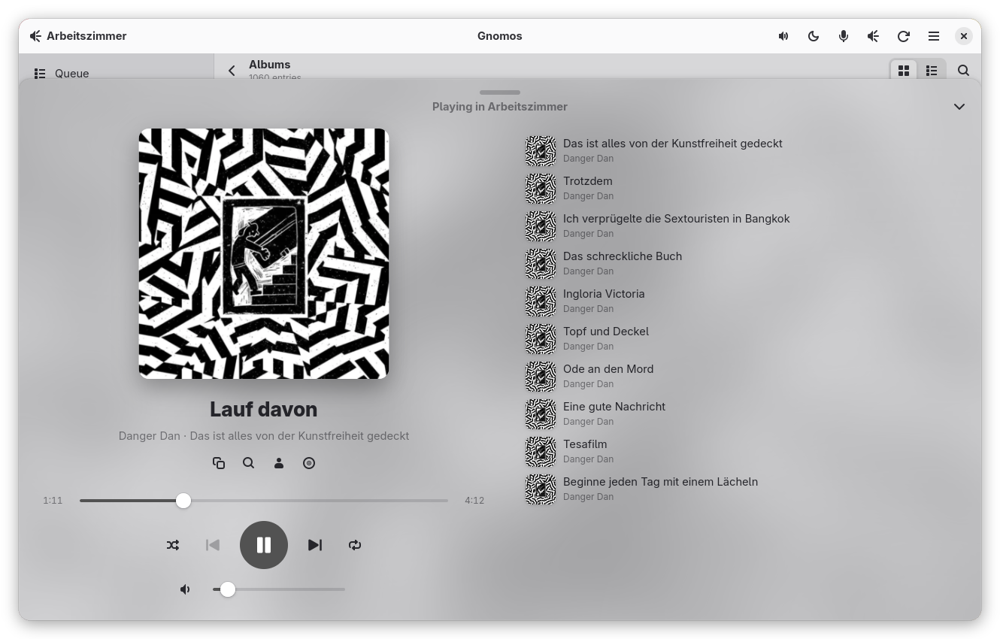
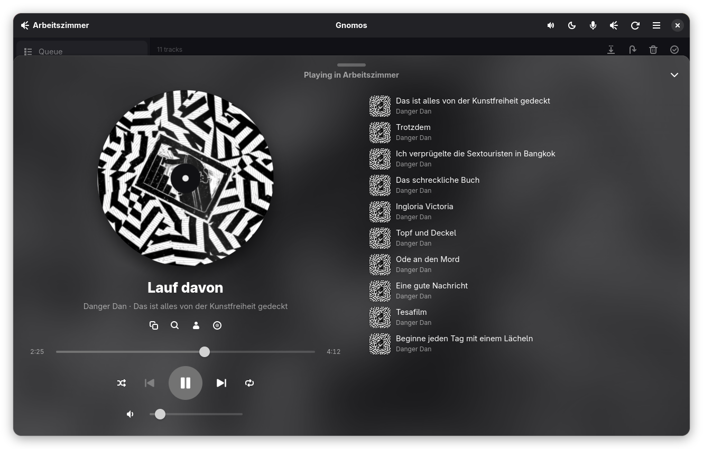
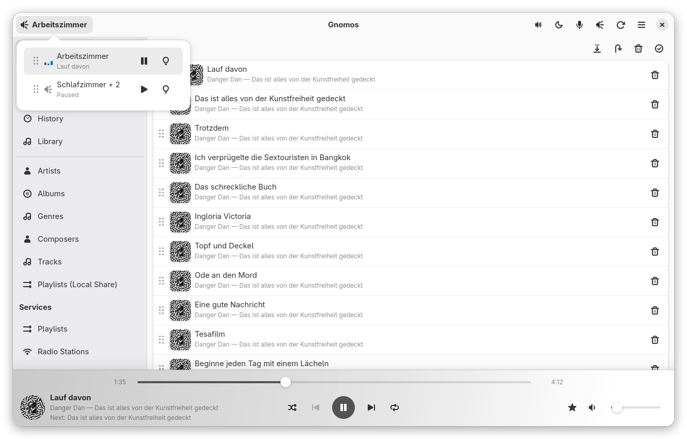
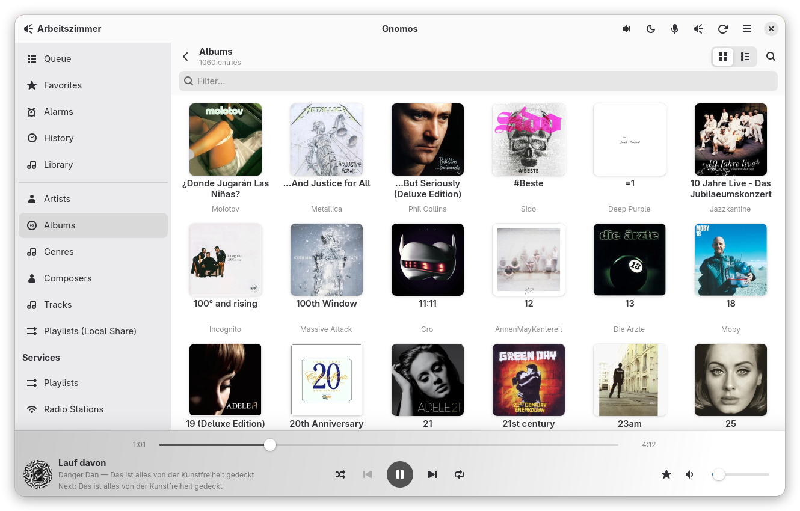
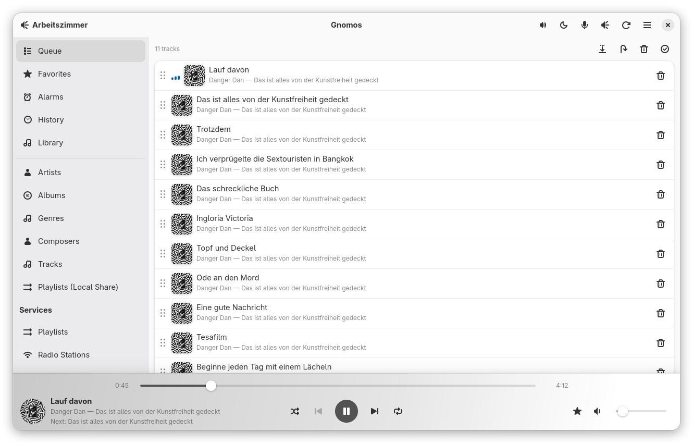
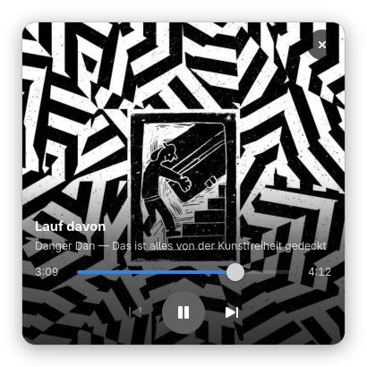

<p align="center">
  
</p>

<h1 align="center">Gnomos</h1>

<p align="center"><strong>Your Sonos speakers, at home on the GNOME desktop.</strong></p>

<p align="center">
  Play music, group rooms and set the volume in every room from a native GTK&nbsp;4 and libadwaita app.
  Gnomos talks to your speakers directly over your home network. No Sonos account and no cloud service needed.
</p>

<p align="center">
  <a href="https://github.com/linuxundich/gnomos/releases/latest"><strong>Download Flatpak</strong></a>
  &nbsp;·&nbsp; Flathub: planned &nbsp;·&nbsp;
  <a href="CHANGELOG.md">Changelog</a>
</p>

<p align="center">
  
</p>

## What it does

### Now Playing, with lyrics

Click the player bar and the current track fills the window: a large cover on a background in its own colors, what plays next, and time-synced lyrics. Click a line to jump to that part of the song. Prefer vinyl? The cover can spin as a record.

<p align="center">
  
</p>

### Every room in one place

The room picker shows what plays where. Drag a room onto another to group them, set each room's volume, or start and pause any room with one click.

### Your whole music collection

Browse the music share on your network, your Sonos favorites and playlists, internet radio and the services you linked to Sonos, such as Spotify. Even large libraries open instantly as a cover grid.

<p align="center">
  
  
</p>

### Part of your GNOME desktop

Media keys, the lock screen and the media player in Quick Settings work right away. An optional Shell extension adds a volume slider for every room to Quick Settings. A poster-style mini player, dark mode and desktop notifications are built in.

<p align="center">
  
  
</p>

### A second life for older speakers

Gnomos works with any Sonos system on your network and keeps first-generation players going, the ZP80, ZP90, ZP100, ZP120 and CR100, which the current Sonos apps no longer support.

## How it works

1. Gnomos finds your Sonos speakers on the local network by itself.
2. It plays everything Sonos can reach: your music share, radio stations and linked services.
3. Everything else stays at home. Lyrics from LRCLIB and artist photos from Deezer are the only online lookups, and both stay off until you turn them on.

Under the hood Gnomos uses [libnoson](https://github.com/janbar/noson), the library behind [noson-app](https://github.com/janbar/noson-app).

## Install

> [!NOTE]
> A release on Flathub is planned. For now, install the Flatpak bundle from the Releases page.

1. Download `gnomos-<version>-x86_64.flatpak` from the [latest release](https://github.com/linuxundich/gnomos/releases/latest).
2. Install it:

```sh
flatpak install --user gnomos-*.flatpak
```

Flatpak fetches the GNOME 51 runtime from Flathub if it is missing. Bundles don't update themselves, so check the Releases page for new versions.

Optional: the [GNOME Shell extension](gnome-shell-extension/gnomos-volume@linuxundich.de/README.md) for room volumes in Quick Settings. To build Gnomos yourself, see [docs/BUILDING.md](docs/BUILDING.md).

## More

- [All features](docs/FEATURES.md) · [Changelog](CHANGELOG.md) · [Architecture notes](ARCHITECTURE.md)
- [Translate Gnomos](docs/TRANSLATING.md) into your language (English and German included)
- Found a bug or tested other Sonos hardware? [Open an issue](https://github.com/linuxundich/gnomos/issues)

Gnomos is free software under the [GPL-3.0-or-later](LICENSE). It is a personal project, tested on the author's own first-generation Sonos household. Album covers in the screenshots belong to their artists and labels.
